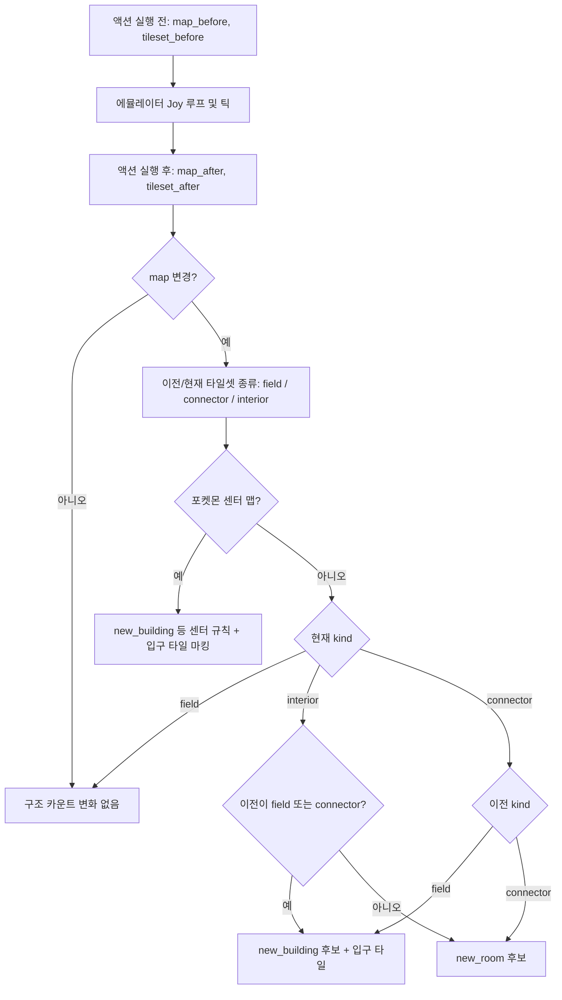
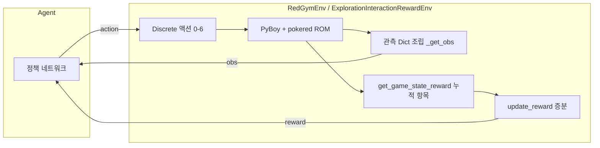

# 포켓몬 레드 RL 환경 — 입출력·액션·리워드·패널티·구조

이 문서는 `pokemonred_puffer.environment.RedGymEnv` 및 `pokemonred_puffer.rewards.baseline.ExplorationInteractionRewardEnv`(기본 학습 설정)를 기준으로 정리합니다. 기본 `config.yaml`의 `env.reduce_res: True`, `env.two_bit: True`, `env.use_global_map: False`를 가정합니다.

---

## 1. 입출력 (I/O)

### 1.1 관측 (`observation`)

Gymnasium `Dict` 공간. 에이전트는 매 스텝 딕셔너리 관측을 받습니다.

| 키 | 의미 | 형태 (기본 설정) | 비고 |
|----|------|------------------|------|
| `screen` | 게임 화면 (그레이스케일/압축) | `(72, 20, 1)` uint8 | `reduce_res`·`two_bit` 시 가로 80→20 패킹 |
| `visited_mask` | 방문 마스크 오버레이 | `screen`과 동일 shape | 탐험 시각화용 |
| `direction` | 플레이어 방향 | `(1,)` 0~4 | |
| `blackout_map_id` | 마지막 블랙아웃 시 맵 ID | `(1,)` | WRAM `wLastBlackoutMap` 등 |
| `battle_type` | 전투 종류 | `(1,)` 0~2 | 0=비전투, 1=야생, 2=트레이너 |
| `map_id` | 현재 맵 ID | `(1,)` | |
| `bag_items` | 가방 아이템 ID (슬롯) | `(20,)` | 빈 슬롯은 0 등 |
| `bag_quantity` | 수량 | `(20,)` | |
| `species` | 파티 종족값 | `(6,)` | |
| `hp` / `maxHP` | HP | `(6,)` uint32 | |
| `status` | 상태 이상 | `(6,)` | |
| `type1` / `type2` | 타입 | `(6,)` | |
| `level` | 레벨 | `(6,)` | |
| `attack` / `defense` / `speed` / `special` | 스탯 | `(6,)` | |
| `moves` | 기술 (슬롯 4) | `(6, 4)` | |
| `events` | 이벤트 플래그 비트열 | `(320,)` 0~1 | |

`env.use_global_map: True`이면 `global_map` 채널이 추가됩니다 (전역 탐험 맵).

### 1.2 스텝 반환값 (`step`)

표준 Gymnasium API: `(obs, reward, terminated, truncated, info)`.

- **`reward`**: 아래 [리워드 합](#3-리워드-cumulative--incremental)의 **스텝 증분** (`update_reward`).
- **`terminated` (`reset`)**: 에피소드 종료 플래그. 예: 스타팅으로 컷 불가능 파티, 관장 첫 배지 획득(`end_episode_on_first_gym`), 필수 진행률 허용 오차 초과(`required_tolerance`) 등.
- **`info`**: 주기적으로 `agent_stats` 등 (설정에 따라 `state` 바이트 등).

---

## 2. 액션 (Action space)

`gymnasium.spaces.Discrete(7)` — 인덱스 `0`~`6`.

| 인덱스 | 이름 (`VALID_ACTIONS_STR`) | PyBoy 입력 |
|--------|----------------------------|------------|
| 0 | `down` | 아래 화살표 press |
| 1 | `left` | 왼쪽 |
| 2 | `right` | 오른쪽 |
| 3 | `up` | 위 |
| 4 | `a` | A |
| 5 | `b` | B |
| 6 | `start` | START |

한 스텝당 에뮬레이터는 해당 키를 눌렀다 떼고, `action_freq`틱만큼 진행합니다 (`run_action_on_emulator`).

---

## 3. 리워드 (cumulative → incremental)

`ExplorationInteractionRewardEnv.get_game_state_reward()`는 **항목별 누적 기여도** `{키: 값}` 딕셔너리를 반환합니다. 스칼라 보상은 `update_reward()`에서

**이번 스텝 보상 = (새로운 전체 합) − (직전 전체 합)**

으로 계산됩니다. 따라서 각 항목은 “카운트 × 계수” 형태로 **에피소드 동안单调 증가(또는 감소)하는 누적량**에 가중치를 곱한 값입니다.

### 3.1 긍정적 셰이핑 (리워드 계수 > 0)

`config.yaml`의 `rewards.baseline.ExplorationInteractionRewardEnv.reward` 기본값 예시:

| 키 | 의미 (요약) | 기본 계수 |
|----|----------------|-----------|
| `event` | 스토리 이벤트 플래그 진행 | × `5.0` |
| `item` | 에피소드 중 **처음** 가방에 들어온 아이템 **종류** 수 | × `2.5` |
| `gym_core_npc` | 처음 대화한 체육관 NPC (타일셋 GYM) | × `1.5` |
| `npc_first_talk` | NPC 최초 대화 | × `3.0` |
| `object_first_interaction` | 간판/히든오브젝트 등 최초 상호작용 | × `0.6` |
| `new_tile` | **새 좌표** 방문 (풀숲 야생 타일 제외) | × `0.014` |
| `new_building` | **건물/구역** 최초 진입 (필드·게이트→실내 등 규칙) | × `4.0` |
| `new_room` | 연결 구역 간 **새 방/맵** (커넥터 규칙) | × `2.0` |
| `new_npc_textbox` | NPC 대화창 최초 오픈 | × `0.6` |
| `trainer_battle_win` | **트레이너전** 승리 (야생 제외) | × `0.15` |
| `pokecenter_first_entry` | 포켓몬센터 최초 입장 | × `4.0` |
| `pokecenter_heal_hp` | 센터 회복량 (전멸 부활 HP 급등 등은 제외 로직) | × `0.005` (HP 단위) |

### 3.2 패널티·음수 셰이핑 (계수 ≤ 0)

| 키 | 의미 (요약) | 기본 계수 |
|----|----------------|-----------|
| `step_penalty` | 스텝 수에 비례 | × `-0.00004` per step |
| `repeat_npc_penalty` | 같은 NPC 반복 대화 | × `-0.07` |
| `invalid_interaction` | 전투/텍스트 없이 빈 A 입력 등 | × `-0.002` |
| `start_menu_penalty` | 시작 메뉴 오픈 | × `-0.022` |
| `stuck_penalty` | 같은 칸 10프레임 초과 정체 (전투·텍스트 제외) | × `-0.004` |
| `wild_encounter_penalty` | 야생 조우 발생 1회당 | × `-1.2` |
| `death` | 야생전에서 슬롯 HP가 >0→0 (기절) | × `-0.5` |

에피소드 초기화 시 특수 처리: 스타팅에 **컷 가능 포켓몬이 없으면** `reward`에 `-0.5 * total_reward` 페널티가 가해지고 리셋됩니다 (`step` 내부).

---

## 4. “구조” 보상 — 건물 vs 방 (new_building / new_room)

맵 전환 시 `wCurMap`, `wCurMapTileset`으로 **필드(field) / 커넥터(숲·게이트) / 실내(interior)** 를 구분합니다.

- **야외 맵 ID** (`≤ ROUTE_25`)는 타일셋이 잠깐 0이어도 항상 `field`로 취급해 오분류를 막습니다.
- **포켓몬 센터**는 별도 규칙·전멸 후 억제 플래그(`_suppress_pokecenter_shaping_after_blackout`)로 과도한 셰이핑을 줄입니다.
- 필드·커넥터에서 실내로 들어가면 `new_building`, 커넥터↔다른 구역 등은 `new_room` 등으로 카운트합니다.

아래는 한 스텝 안에서의 판정 흐름 요약입니다.

---

## 5. 전체 데이터 흐름 (시스템 구조도)

---

## 6. 설정 변경 시 주의

- `reward.*` 계수는 `config.yaml`의 `rewards.baseline.ExplorationInteractionRewardEnv.reward`에서 바뀝니다.
- 관측 shape은 `reduce_res`, `two_bit`, `use_global_map`에 따라 달라지므로 정책 입력 차원과 일치시켜야 합니다.
